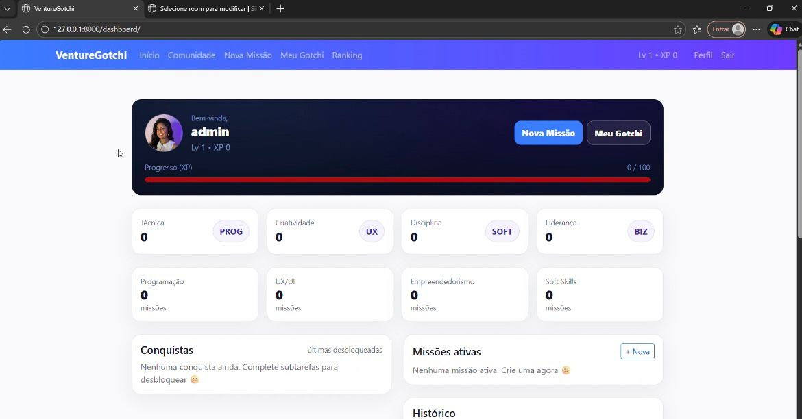
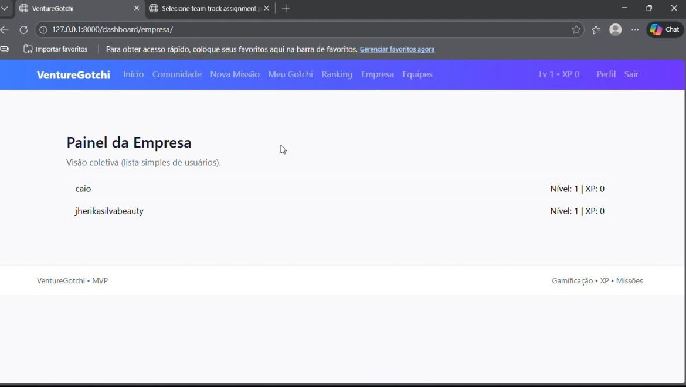
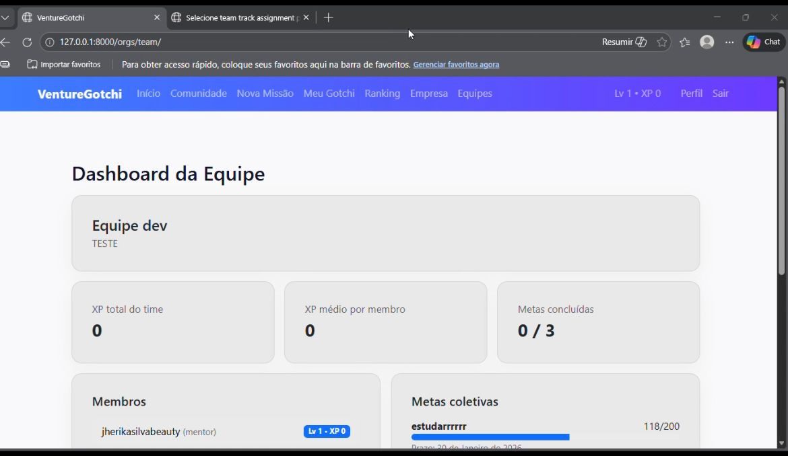
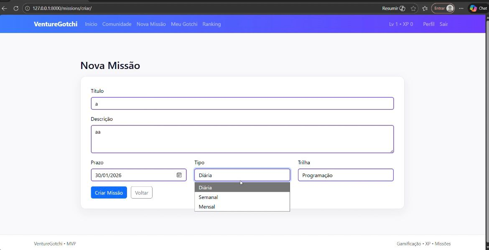
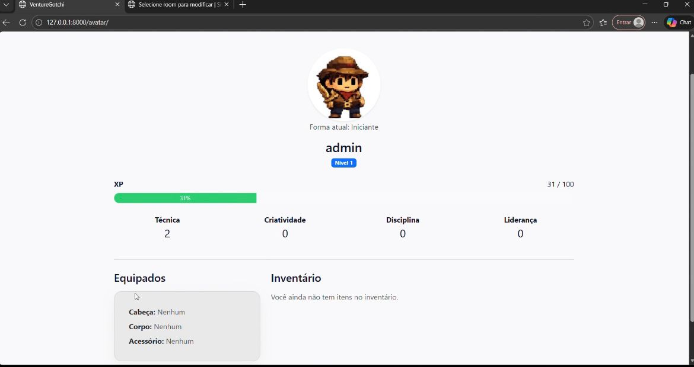
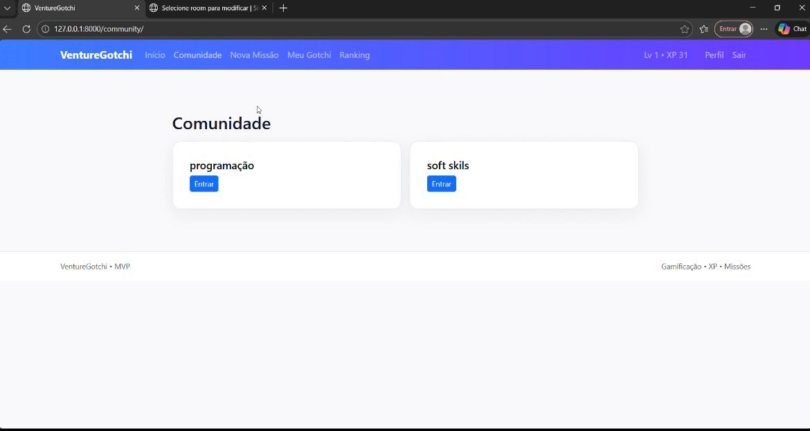

# 🚀 Venture Gotchi

Sistema web gamificado desenvolvido para incentivar produtividade, colaboração em equipe e engajamento dentro de organizações através de missões, recompensas e evolução de personagens virtuais.

A aplicação permite que usuários realizem desafios, acompanhem seu progresso e evoluam seus personagens em um ambiente inspirado em gamificação corporativa.

---

# 🌐 Acesse o Projeto

🔗 Sistema online:  
https://projeto-venture-gotchi-g8jn.onrender.com

📂 Repositório no GitHub:  
https://github.com/JherikaSilva/Projeto-Venture-Gotchi

---

# 📸 Preview do Sistema

## 📊 Dashboard

## 🏢 Dashboard de Empresas

## 👥 Dashboard da Equipe

## 🎯 Sistema de Missões

## 👾 Meu Gotchi

## 🌎 Comunidade

---

# 🎯 Objetivo do Projeto

O Venture Gotchi foi criado para demonstrar como técnicas de gamificação podem ser aplicadas em ambientes organizacionais para:

- aumentar engajamento de equipes  
- incentivar produtividade  
- estimular colaboração  
- acompanhar progresso com dashboards interativos  

O sistema transforma tarefas em missões, recompensando os usuários conforme seu progresso.

---

# ⚙️ Tecnologias Utilizadas

### Backend
- Python  
- Django  

### Banco de Dados
- PostgreSQL  

### Frontend
- HTML  
- CSS  
- JavaScript  

### Ferramentas
- Django ORM  
- Sistema de autenticação de usuários  
- Templates Django  

---

# 🧩 Funcionalidades

✔ Cadastro e autenticação de usuários  
✔ Dashboard com métricas e progresso  
✔ Sistema de missões e desafios  
✔ Evolução do personagem virtual (Gotchi)  
✔ Área de comunidade  
✔ Dashboard de empresas  
✔ Dashboard de equipes  
✔ Sistema gamificado de produtividade  

---

# 🏗 Arquitetura do Projeto

O projeto segue a arquitetura padrão do Django, separando responsabilidades entre:

- Models → estrutura e regras de dados  
- Views → lógica da aplicação  
- Templates → interface do usuário  
- Static Files → estilos e scripts  

---

# ▶️ Como Rodar o Projeto

### 1️⃣ Clonar o repositório

git clone https://github.com/JherikaSilva/Projeto-Venture-Gotchi

### 2️⃣ Entrar na pasta do projeto

cd venture-gotchi

### 3️⃣ Criar ambiente virtual

python -m venv venv

### 4️⃣ Ativar ambiente virtual

Windows

venv\Scripts\activate

Mac / Linux

source venv/bin/activate

### 5️⃣ Instalar dependências

pip install -r requirements.txt

### 6️⃣ Configurar o banco de dados

No arquivo settings.py, configure o PostgreSQL.

### 7️⃣ Rodar as migrações

python manage.py migrate

### 8️⃣ Iniciar servidor

python manage.py runserver

Depois acesse no navegador:

http://127.0.0.1:8000

---

# 📚 Aprendizados

Durante o desenvolvimento deste projeto foram aplicados conhecimentos em:

- desenvolvimento web com Django  
- modelagem de banco de dados com PostgreSQL  
- construção de dashboards  
- lógica de gamificação  
- organização de arquitetura backend  

---

# 👩‍💻 Autores

Jherika Silva  
Estudante de Análise e Desenvolvimento de Sistemas
https://github.com/JherikaSilva

Pericles Santos Silva Junior 
Estudante de Análise e Desenvolvimento de Sistemas
https://github.com/PericlesJunior1212

---

# 📌 Status do Projeto

🚧 Projeto em evolução com melhorias contínuas.

---

# 📄 Licença

Projeto desenvolvido para fins educacionais e portfolio
